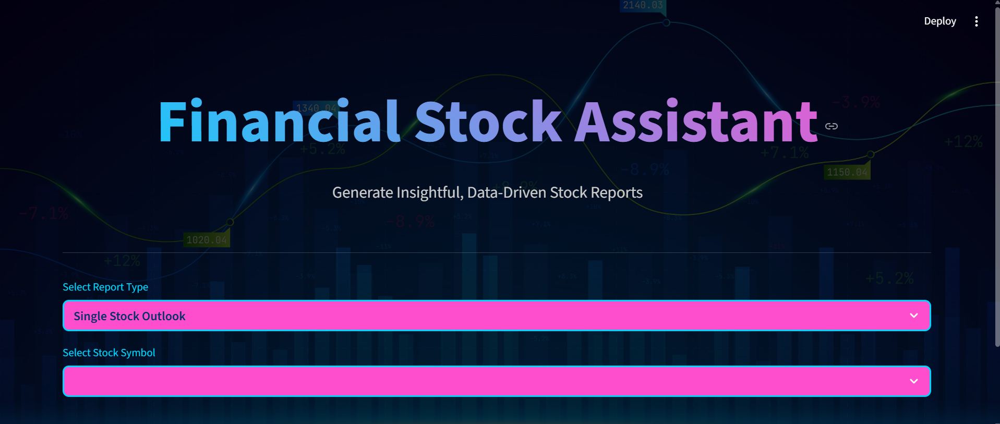
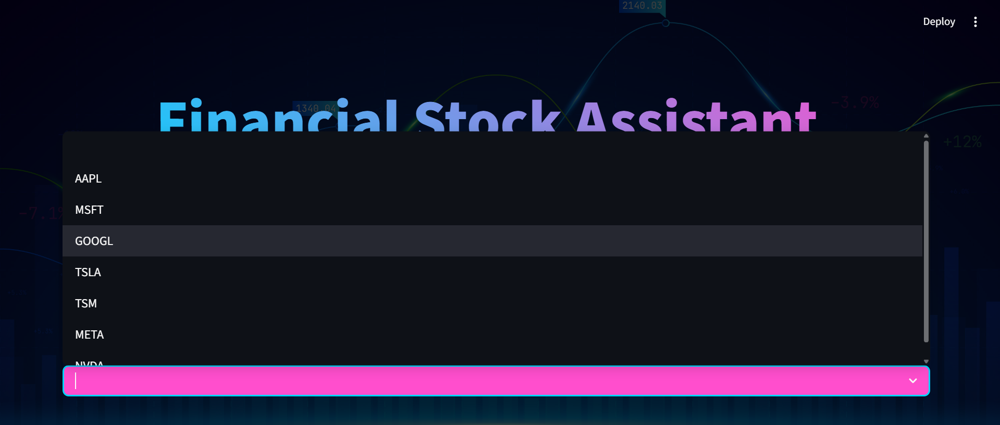
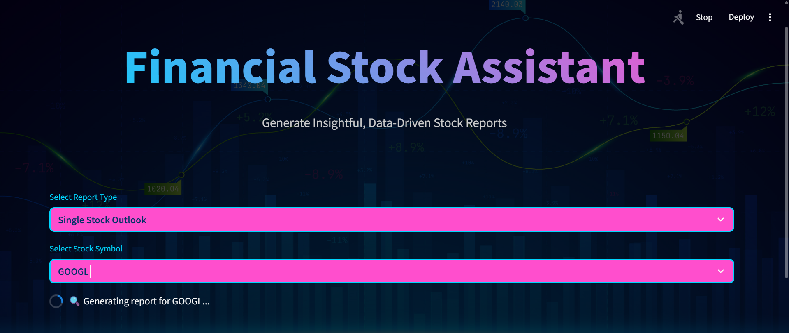
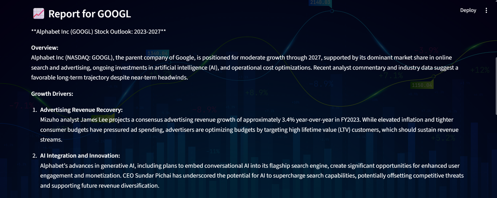
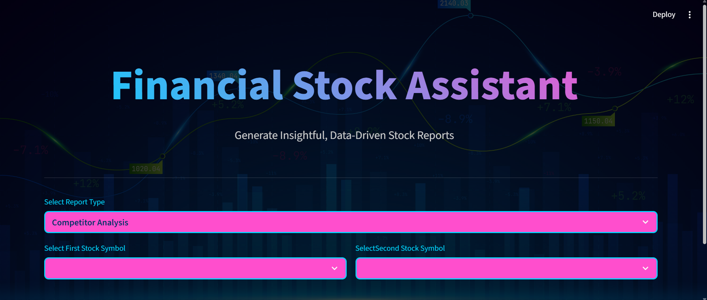
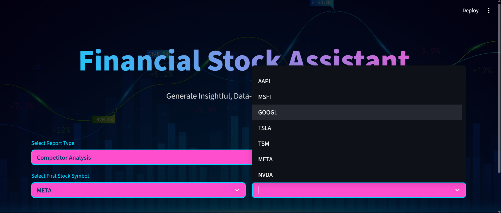
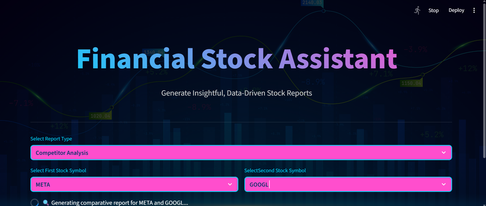
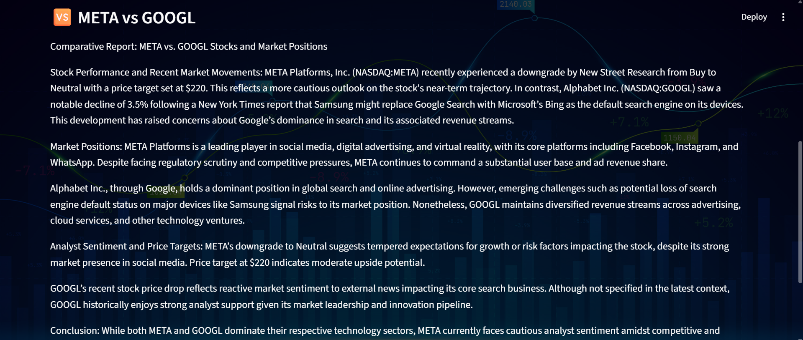

# Financial Stock Assistant

AI-powered stock analysis tool using RAG technology for data-driven financial insights.



## Features

- **Single Stock Analysis**: Generate detailed reports for major stocks with risk assessment and outlook analysis
- **Competitor Comparison**: Side-by-side analysis between two stocks with market positioning insights
- **AI-Powered RAG**: ChromaDB vector store with OpenAI GPT-4.1-mini for intelligent financial analysis


## Technology Stack

- **Frontend**: Streamlit
- **AI/ML**: LangChain, OpenAI GPT-4.1-mini, OpenAI Embeddings
- **Vector Database**: ChromaDB


## Getting Started

### Prerequisites

- [Conda](https://docs.conda.io/en/latest/miniconda.html) (for backend Python environment)
- [OpenAI API Key](https://platform.openai.com/account/api-keys) **or** a GitHub access token (see note below)
- [pip](https://pip.pypa.io/en/stable/)

> **Note:**  
> You can use a GitHub access token as the API key for the OpenAI client in this project.  
> See [here](https://github.com/marketplace/models/azure-openai/gpt-4o-mini) for more details.

### 1. Clone the Repository

```sh
git clone<repository-url>
cd financial-stock-assistant
```

### 2. Setup

1. **Create and activate a Conda environment:**

   ```sh
   conda create -n financial python=3.10 -y
   conda activate financial
   ```

2. **Install dependencies:**

   ```sh
   pip install -r requirements.txt
   ```

3. **Set up environment variables:**

   - Create a `.env` file in your project root:
     ```
     OPENAI_API_KEY=your_openai_api_key_or_github_token
     ```


4. **Download and Process Data**
   - Run the data fetching script to download financial news articles:
     ```bash
     python src/fetch_data.py
     ```

5. **Index the News Articles**
   - Create the vector database by running the indexing script:
     ```bash
     python src/index_news.py
     ```

## 💻 Usage

### Starting the Application
```bash
streamlit run app.py
```

The application will open in your default web browser at `http://localhost:8501`.

### Using the Interface

#### Single Stock Analysis

1. Select **Single Stock Outlook** from the report type dropdown


2. Choose a stock symbol **(AAPL, MSFT, GOOGL, TSLA, TSM, META, NVDA)**


3. Wait for the AI to generate a comprehensive report


4. Review the detailed analysis including risks and opportunities


#### Competitor Analysis

1. Select **Competitor Analysis** from the report type dropdown


2. Choose two different stock symbols for comparison


3. Wait for the AI to generate a comparative analysis


4. Review the side-by-side market position analysis
